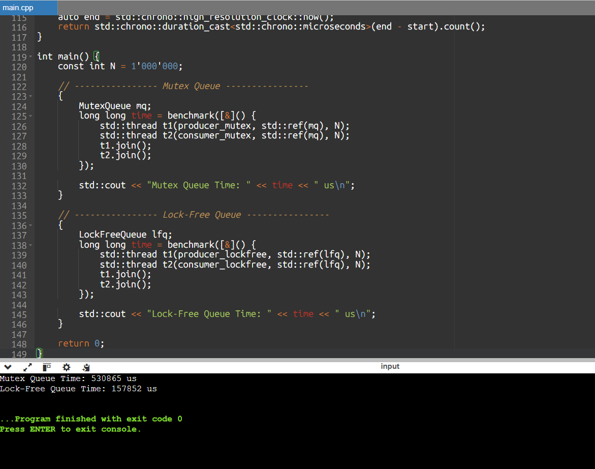

# Low-Latency Queue in C++ (Mutex vs Lock-Free)

This project explores the performance differences between **lock-based** and **lock-free** queue designs in C++ under multithreaded workloads.  
The goal is to understand how synchronization choices impact **latency** and **throughput** in concurrent systems.

---

## 🚀 Project Overview

The project implements and benchmarks two queue designs:

1. **Mutex-Based Queue**
   - Uses `std::mutex` to ensure thread safety
   - Simple and correct baseline
   - Suffers from lock contention under concurrency

2. **Lock-Free SPSC Queue**
   - Single-Producer Single-Consumer (SPSC) design
   - Uses `std::atomic` for synchronization
   - Avoids locks and context switching
   - Optimized for low-latency paths

Both implementations are benchmarked using microsecond-resolution timing.

---

## 🛠️ Tech Stack

- **Language:** C++17
- **Concurrency:** `std::thread`, `std::mutex`, `std::atomic`
- **Data Structures:** STL containers, ring buffer
- **Benchmarking:** `std::chrono`
- **Toolchain:** GCC / MinGW / MSYS2 / Linux

---

## 🧪 Benchmark Design

- One producer thread
- One consumer thread
- One million enqueue/dequeue operations
- Total execution time measured in microseconds

---

## 📊 Sample Output

The following screenshot shows the benchmark results comparing the mutex-based
queue with the lock-free SPSC queue on a local machine.



Example output:

Mutex Queue Time: 530865 us
Lock-Free Queue Time: 157852 us


> Exact timings may vary depending on hardware, OS scheduler, and background load.  
> The lock-free queue consistently demonstrates lower latency by avoiding lock
> contention and context switching.

---

## 🧠 Key Learnings

- Lock contention significantly impacts latency in concurrent systems
- Lock-free designs reduce blocking and context switching
- Atomic memory ordering (`relaxed`, `acquire`, `release`) is critical for correctness
- Performance assumptions must be validated through real measurements
- Well-scoped lock-free designs (such as SPSC) are easier to reason about and optimize

---

## ⚠️ Design Notes

- The lock-free queue is designed specifically for **Single-Producer Single-Consumer (SPSC)** scenarios
- Extending this design to multiple producers or consumers would require additional synchronization
- Busy-waiting (spinning) is used intentionally to favor low latency over CPU efficiency

---

## 📎 Build & Run

Compile with optimizations enabled:

```bash
g++ -O2 -std=c++17 main.cpp -pthread
./a.out
